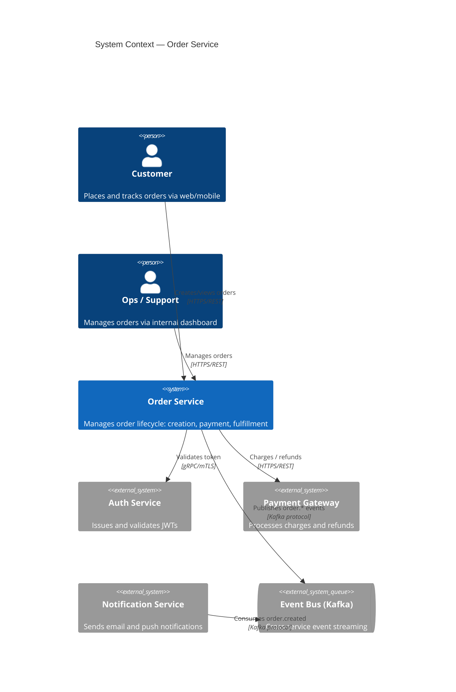
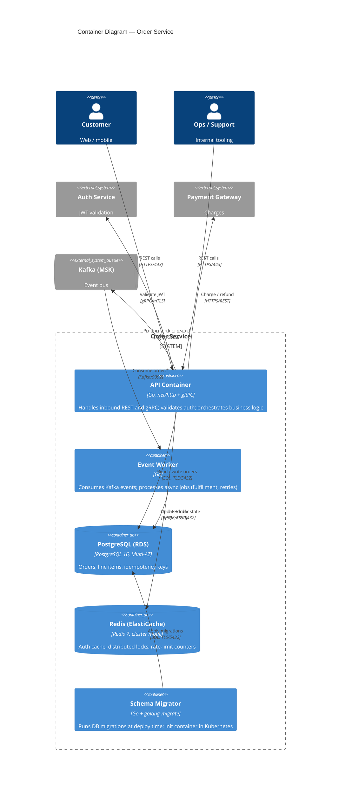
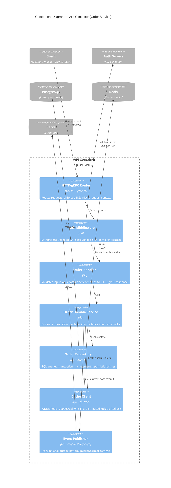
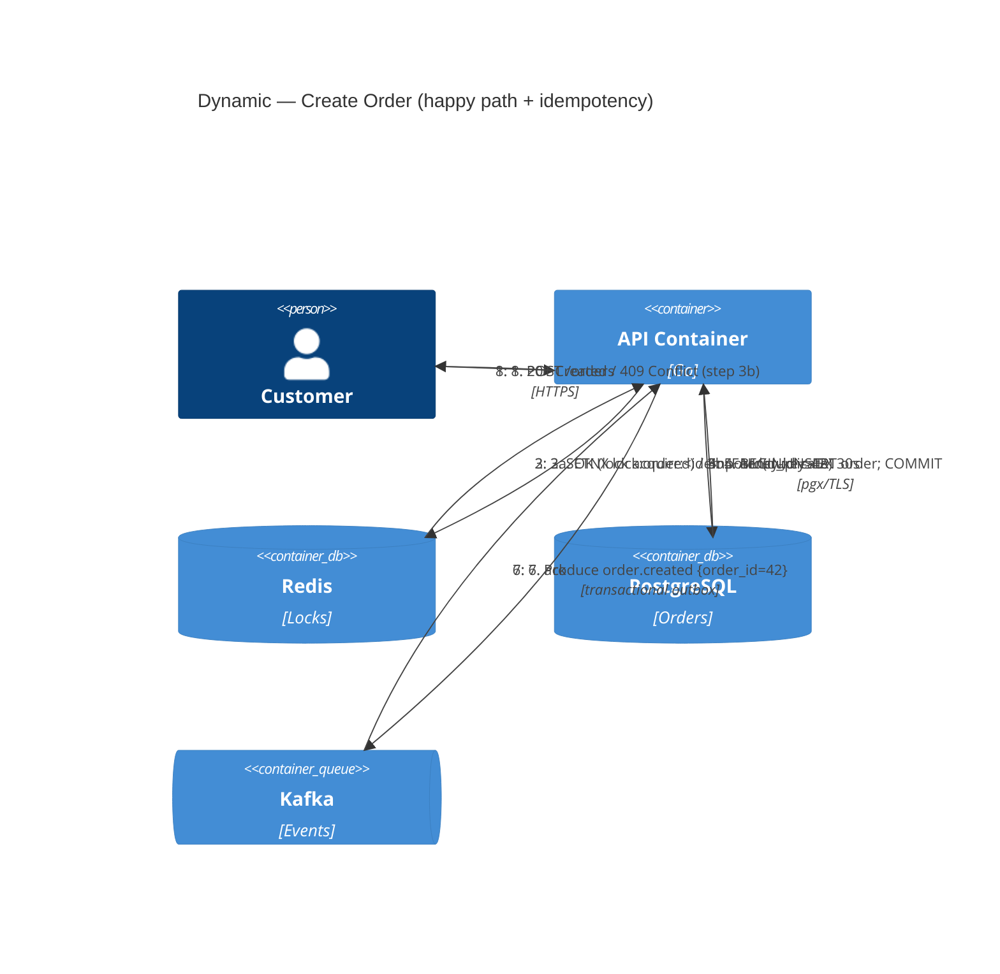
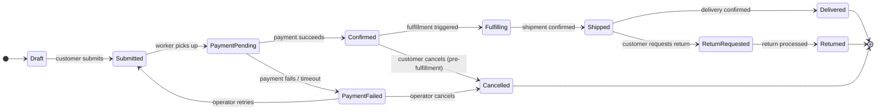

# Diagram Templates — C4 Model (Mermaid)

All diagrams follow the [C4 model](https://c4model.com): Context → Container → Component → Code.
Mermaid's C4 support renders in GitHub, Notion, GitLab, and most modern wikis.

**C4 zoom levels used in sessions:**
| Level | Mermaid keyword | Audience | When to produce |
|---|---|---|---|
| L1 System Context | `C4Context` | Everyone (PMs, execs) | Always |
| L2 Container | `C4Container` | Engineers, architects | Always |
| L3 Component | `C4Component` | Engineers on that container | When a container is complex |
| Dynamic (sequence) | `C4Dynamic` | Engineers debugging flows | For critical / tricky flows |
| Deployment | `C4Deployment` | SRE, infra | When infra topology matters |

---

## L1 — System Context (`C4Context`)

Who uses the system and what external systems does it touch.



---

## L2 — Container Diagram (`C4Container`)

The deployable units inside the system boundary, their tech, and how they communicate.



---

## L3 — Component Diagram (`C4Component`)

Internal structure of one container. Use when a container has meaningful internal architecture.



---

## Dynamic Diagram — Critical Flow (`C4Dynamic`)

Use for flows where ordering and branching logic matter. Preferred over generic sequence diagrams
because it anchors participants to the C4 containers already defined.



---

## Deployment Diagram (`C4Deployment`)

Maps containers onto infrastructure. Use when topology affects reliability, latency, or cost decisions.

```mermaid
C4Deployment
  title Deployment — Order Service, AWS us-east-1

  Deployment_Node(aws, "AWS us-east-1") {
    Deployment_Node(vpc, "VPC 10.0.0.0/16") {

      Deployment_Node(pubSubnets, "Public Subnets (AZ a/b/c)") {
        InfrastructureNode(alb, "ALB", "AWS ALB", "TLS termination, health checks")
      }

      Deployment_Node(privSubnets, "Private Subnets (AZ a/b/c)") {
        Deployment_Node(eks, "EKS Cluster", "Kubernetes 1.30, managed node groups") {
          Container(api, "API Container", "Go", "3 replicas min; HPA on CPU+RPS")
          Container(worker, "Event Worker", "Go", "KEDA-scaled on Kafka consumer lag")
          Container(migrator, "Schema Migrator", "Go", "Init container, runs once per deploy")
        }

        Deployment_Node(rds, "RDS PostgreSQL 16", "Multi-AZ, db.r7g.xlarge") {
          ContainerDb(pgPrimary, "Primary", "PostgreSQL", "Writes")
          ContainerDb(pgStandby, "Standby", "PostgreSQL", "Sync replica, auto-failover")
        }

        Deployment_Node(elasticache, "ElastiCache Redis 7", "Cluster mode, 3 shards x 1 replica") {
          ContainerDb(redis, "Redis Cluster", "Redis", "Cache + Redlock")
        }

        Deployment_Node(msk, "MSK Kafka", "3 brokers, RF=3, min ISR=2") {
          ContainerQueue(kafka, "Kafka", "MSK", "order.* topics")
        }
      }
    }

    Deployment_Node(global, "Global / Regional") {
      InfrastructureNode(ecr, "ECR", "Container Registry", "Image pull at deploy time")
      InfrastructureNode(s3, "S3", "Object Store", "Artifacts, backups, Terraform state")
    }
  }

  Rel(alb, api, "HTTP/8080", "internal")
  Rel(api, pgPrimary, "SQL/5432", "TLS")
  Rel(api, redis, "RESP3/6379", "TLS")
  Rel(api, kafka, "9092")
  Rel(kafka, worker, "consume 9092")
  Rel(worker, pgPrimary, "SQL/5432", "TLS")
  Rel(migrator, pgPrimary, "SQL/5432", "TLS")
```

---

## State Machine (supplement — not a C4 level)

Use alongside C4 diagrams when a domain entity has a non-trivial lifecycle.



---

## Quick Reference — C4 Mermaid Shape Cheat Sheet

| Shape macro | Renders as | Use for |
|---|---|---|
| `Person(id, name, desc)` | Person (stick figure) | Human users |
| `Person_Ext(...)` | Person, grey | External users |
| `System(id, name, desc)` | Box | Your system |
| `System_Ext(...)` | Box, grey | External systems |
| `SystemDb(...)` | Cylinder | External DB |
| `SystemQueue(...)` | Queue shape | External queue |
| `Container(id, name, tech, desc)` | Box | Deployable unit |
| `ContainerDb(...)` | Cylinder | Database container |
| `ContainerQueue(...)` | Queue shape | Message queue container |
| `Component(id, name, tech, desc)` | Box | Internal component |
| `Deployment_Node(id, name, tech)` | Dashed boundary | Infra node / environment |
| `InfrastructureNode(...)` | Hexagon | Infra element (LB, CDN) |
| `Rel(from, to, label, tech?)` | Arrow | Relationship |
| `Rel_Back(...)` | Reverse arrow | Response direction |
| `BiRel(...)` | Bidirectional | Two-way comm |
